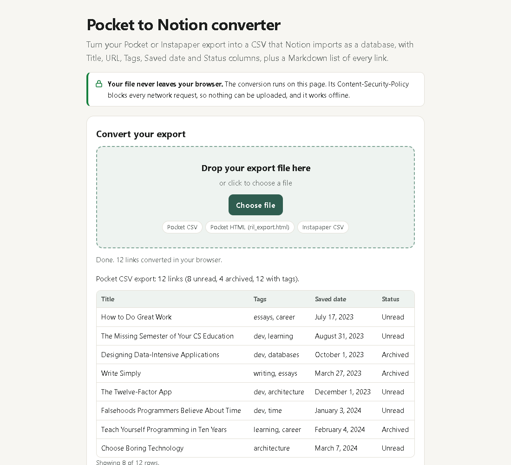

# Pocket to Notion converter

Turn your **Pocket** (CSV or HTML) or **Instapaper** (CSV) export into a CSV that **Notion imports as a database**, with `Title`, `URL`, `Tags`, `Saved date` and `Status` columns, plus a Markdown checklist of every link.

It's a single HTML page. Your file is read and converted in the browser and is never uploaded anywhere.



## What it does

| In your Pocket export | In the Notion CSV |
|---|---|
| `title` | **Title** |
| `url` | **URL** |
| `tags` (`reading\|ai`) | **Tags** (`reading, ai`), ready for a Multi-select property |
| `time_added` (`1700000000`) | **Saved date** (`November 14, 2023 10:13 PM`, UTC, the format Notion uses in its own exports) |
| `status` (`unread` / `archive`) | **Status** (`Unread` / `Archived`) |

It also:

- reads Pocket's older `ril_export.html` file, where the "Unread" and "Read Archive" headings become the Status;
- reads Instapaper's CSV, where JSON tags become normal tags and custom folders (and "Starred") are kept as tags;
- removes duplicate URLs and rows without a valid `http(s)` link;
- splits big libraries into several files under 5 MB, the per-file limit on Notion's Free plan;
- gives you a Markdown list grouped by Unread / Archived, handy for Obsidian or a plain notes file.

## Why I built it

Mozilla shut Pocket down on July 8, 2025, and exports closed on October 8, 2025 ([Mozilla's announcement](https://blog.mozilla.org/en/mozilla/building-whats-next/)). A lot of people downloaded their export and then got stuck: if you drop the raw Pocket CSV into Notion, `time_added` comes in as a Unix timestamp number and all the tags of an item end up as one long `a|b|c` value. The HTML export imports as a single page of links instead of a database.

The existing options were Python scripts that need your Notion `token_v2` cookie, or a browser extension built on the Pocket API, which no longer exists. I wanted something you can open, drop a file on, and be done.

## How to use it

**Online:** <https://fullclip.roledawn.com/tools/pocket-to-notion>

**Locally:** download or clone this repo and open `index.html` in any modern browser. No build step, no install, no server. It works offline.

```bash
git clone https://github.com/binbuilds0/pocket-to-notion.git
cd pocket-to-notion
# then open index.html (double-click it, or:)
start index.html      # Windows
open index.html       # macOS
xdg-open index.html   # Linux
```

1. Find your export. Pocket sent a `.zip`; unzip it and use the `.csv` inside (for example `part_000000.csv`), or `ril_export.html` from older exports.
2. Drop it on the page (or click **Choose file**).
3. Click **Download Notion CSV**. If your library is large you get several numbered parts.

Want to try it first? Use [`examples/pocket-sample.csv`](examples/pocket-sample.csv).

### Privacy

The page has a Content-Security-Policy with `connect-src 'none'`, so the browser blocks every network request from it. The file is read with the File API and converted in that tab. There is no analytics, no server and no build output you have to trust: the code you see in `pocket-convert.js` and `app.js` is the code that runs.

## Importing the CSV into Notion

From [Notion's help page on importing data](https://www.notion.com/help/import-data-into-notion):

1. In Notion, open **Settings → Import → CSV**, or type `/csv` on a page, and upload the file. Notion creates a new database: one page per row, one property per column.
2. If **Tags** comes in as text, change the property type to **Multi-select**. The comma-separated values become separate tags. Set **Saved date** to **Date** and **Status** to **Select** if needed.
3. To add to an existing database instead, open it and click **••• → Merge with CSV**. Imports add rows and don't update existing ones, so merge each file once.
4. File size limits are 5 MB per file on the Free plan and 50 MB on paid plans. The converter splits the CSV for you when it would be bigger than about 4.5 MB: import part 1, then merge the rest.

## Limitations

- **Links only, not article text.** Notion's CSV import creates one page per row with properties. Your titles, URLs, tags, dates and status come across; the articles themselves don't. The export file is a list of links, not saved article text.
- **Dates are in UTC.** Pocket stored timestamps without a time zone, so the CSV writes them in UTC.
- **Highlights are not converted.** The tool reads the list of saved links only.
- **`.zip` files must be unzipped first.**
- Commas inside a tag are replaced with spaces, because Notion splits Multi-select values on commas.

## Development

The converter is plain JavaScript with no dependencies.

```
index.html         the page (markup + styles)
pocket-convert.js  parsing and conversion: pure functions, no DOM, no network
app.js             page logic: file input, preview, downloads
test/              unit tests for pocket-convert.js
examples/          a sample Pocket CSV
```

Run the tests (Node 18 or newer):

```bash
npm test          # same as: node --test
```

Issues and pull requests are welcome, especially sample export files that don't convert the way you expect (remove anything private first).

## Want full articles in Notion?

[Fullclip](https://fullclip.roledawn.com) is a web clipper for Notion, built by the same author: it saves the whole article (text, images, tables and code blocks) into your Notion database as native blocks.

## License

[MIT](LICENSE) © binbuilds. Not affiliated with Notion Labs, Mozilla or Instapaper.
